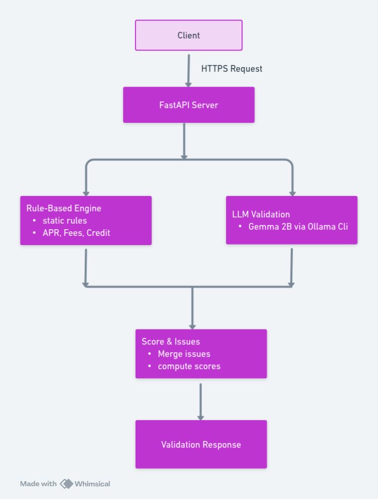

 # Marketplace Validator API Documentation
## Overview
A hybrid validation system that combines rule-based checks with AI-powered analysis to ensure credit card listings comply with marketplace standards.

This project validates credit card product listings against marketplace standards, ensuring regulatory compliance, transparency, and fair consumer disclosure.  

The system uses a hybrid validation approach:
1. Rule-Based Checks → Deterministic validation for regulatory requirements.  
2. LLM-Powered Checks → Contextual validation using an LLM (Gemma 2B via Ollama).  

---
## Architecture Design
# System Design


## Folder Structure
```
.
├── marketplace-standards.md
├── marketplace_validator_prompt.txt
├── README.md
├── requirements.txt
├── sample_listings
│   ├── listing_01.txt
│   ├── listing_02.txt
│   ├── listing_03.txt
│   ├── listing_04.txt
│   ├── listing_06.txt
│   ├── listing_07.txt
│   ├── listing_08.txt
│   ├── listing_09.txt
│   ├── listing_10.txt
│   ├── listing_11.txt
│   ├── listing_12.txt
│   ├── listing_13.txt
│   ├── listing_14.txt
│   ├── listing_15.txt
│   ├── listing_16.txt
│   ├── listing_17.txt
│   ├── listing_18.txt
│   ├── listing_19.txt
│   ├── listing_20.txt
│   ├── listing_21.txt
│   ├── listing_22.txt
│   ├── listing_23.txt
│   ├── listing_24.txt
│   └── listing_25.txt
├── Soln_Doc.md
├── Source
│   ├── llm_validation.py
│   ├── main.py
│   ├── __pycache__
│   ├── rule_based.py
│   └── validator.py
└── System_Design.png
```
## Separation of Concerns Arc
1. API Layer (```main.py```)
   - Concern: HTTP handling, routing, request/response management
   - Responsibility: Receive requests, orchestrate validation, return responses
   - No knowledge of: Validation logic, LLM implementation, rule details
2. Validation (```validator.py```)
   - Concern: Data models and interfaces
   - Responsibility: Define request/response schemas, issue structure
   - No knowledge of: Business logic, implementation details
3. Rule-Based Engine (```rule_based.py```)
   - Concern: Deterministic business rules
   - Responsibility: Check specific compliance patterns, score calculation
   - No knowledge of: API layer, LLM implementation
4. LLM Validation (```llm_validation.py```)
   - Concern: AI-powered validation
   - Responsibility: Semantic analysis, contextual understanding
   - No knowledge of: Rule-based logic, API details
## Validation Flow
- Request Receipt: Json Payload via Post ```/validate-listing```
- Dual Validation: Parallel rule-based + LLM Validation
- Issue Aggregation: Combined results (rule + llm)
## API Specification
# Endpoint
```
POST /validate-listing
Content-Type: application/json
```
# Request Schema
```
{
  "card_name": "string",
  "description": "string",
  "features": {
    "APR": "string",
    "Annual Fee": "string",
    "Credit Requirement": "string",
    "additionalProp3": "string"
  }
}
```
# Response Schema
```
{
  "card_name": "string",
  "compliance_score": 0-100,
  "issues": [
    {
      "problem": "string",
      "suggestion": "string"
    }
  ]
}
```
## Validation logic
# Rule-Based
- Compliance Criteria
  - APR Disclosure: Contains "APR" and "Variable" terminology
  - Fee Transparency: Include unit of currency £ and specific amount
  - Credit Requirements
scoring: Each violation is minus 15 points from the hardcoded total obtainable points of 100
# LLM-Powered Validation
- Regulatory Compliance
- Content quality and clarity
- Prohibited language detection
- Ethical standard adherence
Model{ Gemma 2B running via ollama local inference}
## Requirements
```
fastapi==0.104.1
uvicorn==0.24.0
pydantic==2.5.0
python-multipart==0.0.6
ollama ==0.1.2
```
## How to Run
```
1. clone repository
git clone https://github.com/Shegun93/Experian-ml-challenge.git

2. Navigate to the directory
cd Experian-ml-challenge

3. Install requirements
pip install -r requirements.txt

4. Run Script
uvicorn main:app --reload

P.S: Make sure Gemma is running first locally via ollama. 

ollama run gemma:2b
```
## Assumptions
The assumptions made are contained in [Assumptions](https://github.com/Shegun93/Experian-ml-challenge/blob/master/Assumptions.md)
## Production Servicing

Click [High Production Deployment Architecture](https://github.com/Shegun93/Experian-ml-challenge/blob/master/High-Level-Depl-Arch.md) for the  High level design on how to serve this in a production cloud environment.
P.S: I am very heavy with AWS reason for my choice however, I have decent experience with GCP and Azure. 


  
  

