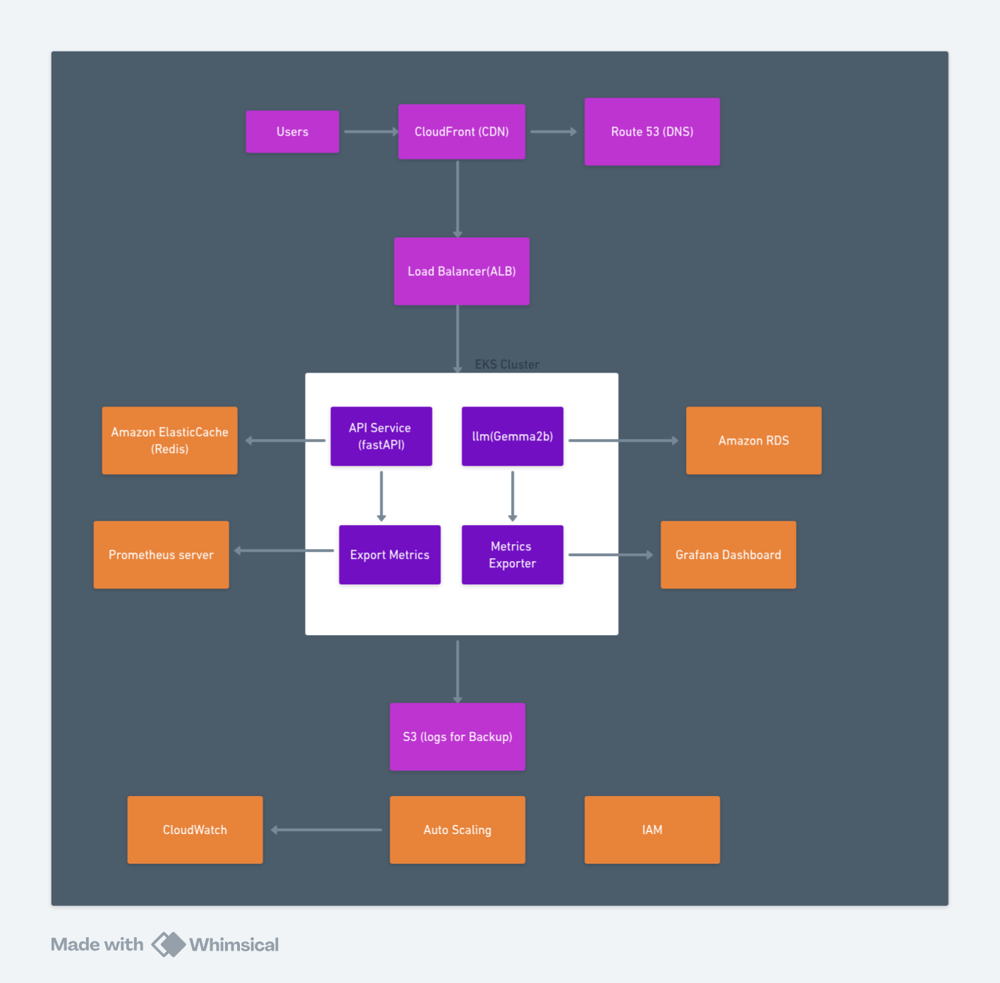

# High Production Deployment Architecture

This deployment infrastructure is designed to ensure high availability, maintainability, and scalability of the service.  

> **Note:** Before provisioning and/or deciding the final infrastructure setup, I always run **load testing** to establish baseline performance requirements and detect bottlenecks.

---

## Assumptions

### 1. Traffic Expectations
- Average traffic: Low to medium (hundreds to thousands of requests/day).  
- Peak traffic: May reach tens of thousands of requests/day during promotions or large-scale comparisons.  

### 2. Model Hosting (LLM - Gemma2b)
- Deployed inside the EKS cluster on GPU-enabled nodes if inference latency is critical.  
- Model weights are containerized and optimized (via **Ollama runtime**).  

### 3. API Layer (FastAPI)
- Stateless microservices containerized with Docker.  
- Horizontal scaling via Kubernetes Horizontal Pod Autoscaler (HPA).  

### 4. Data Layer
- Amazon RDS (Postgres/MySQL) stores validated listings, user queries, and audit logs.  
- Redis (Amazon ElastiCache) caches recent validation results to reduce repeated LLM calls and improve latency.  

### 5. Monitoring & Logging
- Prometheus scrapes metrics (API latency, CPU/GPU utilization).  
- Grafana dashboards provide observability and alerting.  
- Amazon S3 used for logs and backup storage (auditability & disaster recovery).  

### 6. Networking & Security
- CloudFront CDN improves global response times.  
- Route 53 DNS for domain resolution and failover support.  
- Application Load Balancer (ALB) distributes requests across pods.  
- TLS for encryption, IAM roles for least-privilege access.  

### 7. Resilience
- Multi-AZ deployment for RDS and EKS.  
- Automatic failover for Redis.  
- Kubernetes auto-healing enabled.  

### 8. CI/CD Pipeline
-  GitHub Actions or  AWS CodePipeline  manages build, test, and deployment. N.B: I use gitbub actions most often  
- Canary or blue/green deployments used to minimize downtime.  

---

## Deployment Strategy

1. **Containerization**
   - Build Docker images for API (FastAPI) and LLM (Ollama runtime).  
   - Push to Amazon ECR.  

2. **Kubernetes (EKS)**
   - Deploy via Kubernetes manifests.  
   - Configure HPA for auto-scaling based on CPU/GPU load and request latency.  

3. **Networking**
   - Front requests via CloudFront → ALB → EKS Ingress.  
   - Secure APIs with HTTPS/TLS termination at ALB.  

4. **Data Persistence**
   - Deploy Amazon RDS (multi-AZ) for structured data.  
   - Enable Redis (ElastiCache) for caching validation responses.  
   - Store logs and model checkpoints in S3.  

5. **Monitoring & Observability**
   - Export application metrics with Prometheus.  
   - Visualize dashboards and configure alerts in Grafana.  
   - Centralized logging shipped to CloudWatch Logs** and S3 backups.  

6. **Resilience & Recovery**
   - Enable RDS automated backups and snapshots.  
   - Set up multi-AZ failover for both RDS and Redis.  
   - Kubernetes auto-restart and pod rescheduling for service continuity.  

7. **CI/CD**
   - Automate pipeline with GitHub Actions/AWS CodePipeline -- I often use GitHub Actions.  
   - Enforce unit tests, integration tests, and smoke tests before deployment.  
   - Use blue/green or canary releases to reduce downtime.  

---

## Diagram

---

## Cost Optimizations
- Use spot instances for GPU workloads where possible.  
- Aggressive caching to reduce unnecessary LLM calls.  
- Auto-scale down during off-peak hours.  
